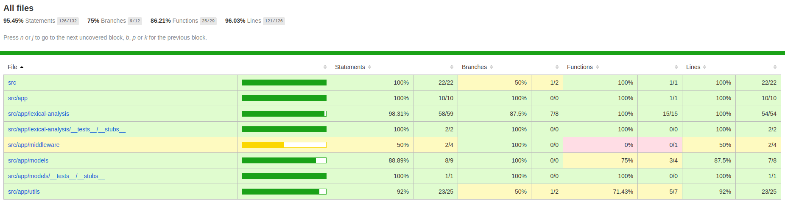

## Lexical Analysis

Following APIs are exposed via the application:

- GET `localhost:8888/` => for swagger documentation
- POST `localhost:8888/complexity` => for lexical analysis APIs
  - Return the lexical density of the inputted text. The input text should be provided via the request.
    - query parameters (optional): `{ "mode": "verbose" }`
    - body: `{ "input_text": "The lexical density of the text here will be computed" }`

### Local Setup

- Install nvm
- run `nvm install 10.16`
- run `nvm use 10.16`
- run `git clone https://github.com/madhavhugar/LexicalAnalysis.git`
- expose env vars 
  - `cp .env.example .env`
  - `yarn setenv`
- install dependencies `yarn install`
- run `yarn start`

### Docker setup

- Install Docker & docker-compose
- Install nvm
- run `nvm install 10.16`
- run `nvm use 10.16`
- run `git clone https://github.com/madhavhugar/LexicalAnalysis.git`
- install dependencies `yarn install`
- compile the app `yarn build`
- if you get any tsc error you might need to install typescript globally (`npm i -g typescript`)
- run `docker-compose up`, 
  - mongo (port 27017)
  - mongo-express (port 8081)
  - lexical-app (port 8888)

### Project details

- navigate to `localhost:8081` for mongo-express you will access the gui for mongo
- navigate to `localhost:8888/` for swagger documentation
- navigate to `localhost:8888/complexity` for lexical analysis APIs

### Test coverage report

